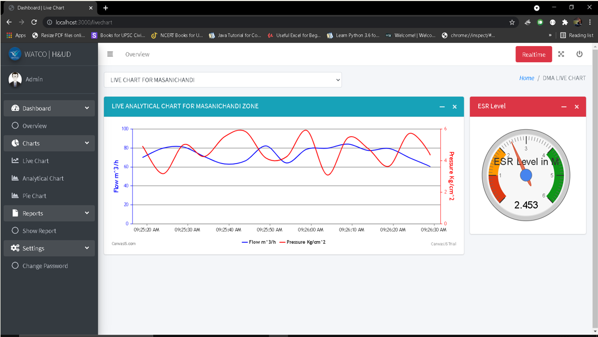

# Real-Time-Water-Supply-Data-Acquisition-Monitoring
###  This is my final year project developed using Node js , MongoDB, Express js , EJS , CSS , Rabbitmq, Canvas js , Chart js ,Google maps.
####  You can simply pull the project and do npm i then npm start it will open in browser as http://localhost:3000 . 
##### As It does not have much data so you have to add data to database for visualizing the graphs and charts

### Sample Layouts of this Project

